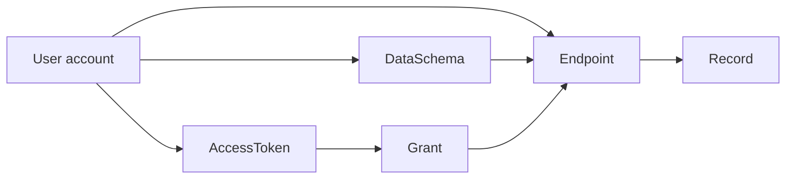

# Architecture Overview

This app is a single Next.js application that contains both the browser
dashboard and all API routes. There is no separate backend service.

The product flow is:

1. A user signs up or signs in.
2. The user creates a `DataSchema`, which describes a data shape.
3. The user creates an `Endpoint`, which exposes that schema as a REST resource.
4. The user creates an `AccessToken`, which grants external callers read and/or
   write access to one or more endpoints.
5. External callers send requests to `/api/v1/:endpoint` with
   `Authorization: Bearer <token>`.
6. The app validates the token, checks the endpoint and grant, validates record
   data against the schema, and reads or writes `Record` documents in MongoDB.

## Mental Model



The central relationship is `User -> Endpoint -> Record`.

Every record query must include both:

```ts
{
  userId: auth.userId,
  endpointId: auth.endpoint._id
}
```

That double scope keeps data isolated even if two users choose the same endpoint
slug.

## Request Families

The app has two different API families with different authentication.

| Family | Routes | Auth style | Used by |
| --- | --- | --- | --- |
| Dashboard API | `/api/auth/*`, `/api/schemas`, `/api/endpoints`, `/api/tokens` | HTTP-only session cookie | The React dashboard |
| Public API engine | `/api/v1/[endpoint]`, `/api/v1/[endpoint]/[id]` | Bearer access token | External clients, curl, apps, scripts |

Dashboard APIs are for managing configuration. Public API routes are the
generated REST API that users call after they create endpoints and tokens.

## Runtime Boundaries

Next.js can run code in different runtimes. This app intentionally separates
Edge-safe code from Node-only code.

| Runtime | Files | Notes |
| --- | --- | --- |
| Edge middleware | `middleware.ts`, `lib/auth/jwt.ts`, `lib/env.ts` | Verifies session JWT signature before allowing `/dashboard/*`. It must not import Mongoose, Redis, Node `crypto`, or `next/headers`. |
| Node route handlers | `app/api/**/route.ts`, most `lib/**` files | Can use MongoDB, Redis, cookies, `bcryptjs`, and Node `crypto`. |
| Browser client | `app/(dashboard)/**`, `components/**`, `lib/client/**` | Uses React, TanStack Query, and `fetch`. It must not import server-only code. |

If a file imports `mongoose`, `ioredis`, `crypto`, or `next/headers`, treat it as
server-only unless the framework says otherwise.

## Directory Map

```text
app/
  page.tsx
  (auth)/
    sign-in/page.tsx
    sign-up/page.tsx
  (dashboard)/
    dashboard/layout.tsx
    dashboard/page.tsx
    dashboard/schemas/page.tsx
    dashboard/endpoints/page.tsx
    dashboard/tokens/page.tsx
  api/
    auth/
    schemas/
    endpoints/
    tokens/
    v1/
lib/
  api/
  auth/
  client/
  db/
  models/
  records/
  validation/
components/
providers/
```

## Important Layers

### Route handlers

Files under `app/api/**/route.ts` are the HTTP entry points. They should:

1. Authenticate or authorize the request.
2. Parse and validate input.
3. Connect to MongoDB when data access is needed.
4. Scope queries by `userId`.
5. Return standardized JSON responses.

### Shared API helpers

`lib/api/respond.ts` gives route handlers a consistent response style:

```ts
ok({ ... })
created({ ... })
badRequest("Validation failed", { fields })
unauthorized()
notFound()
withErrorHandling(async () => { ... })
```

`withErrorHandling` catches unexpected errors and returns a generic 500 so
internal details are not leaked to clients.

### Models

Mongoose models live in `lib/models`. They define persistence shape and indexes,
not all business rules. Some important validation still happens in route
handlers or in `lib/records/validate.ts`.

### Frontend hooks

The React dashboard does not call `fetch` directly from pages. It uses hooks from
`lib/client/hooks.ts`, which wrap the shared `api()` fetch helper and TanStack
Query. This keeps cache keys and invalidation rules in one place.

## Core Invariants

Keep these rules in mind before editing:

1. Dashboard routes must call `requireSession()` or otherwise verify the current
   session.
2. Dashboard database queries must include `userId: auth.session.userId`.
3. Public API routes must go through `gate()`, which calls
   `authorizePublicRequest()` and `rateLimit()`.
4. Public record queries must include both `userId` and `endpointId`.
5. Plaintext access tokens must never be stored. Store only `tokenHash` and show
   the plaintext once during creation.
6. Serialized API responses must not include `passwordHash` or `tokenHash`.
7. Middleware must remain Edge-safe and must not import Node-only dependencies.
