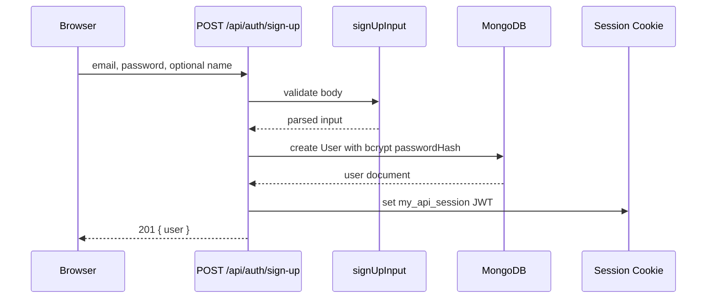
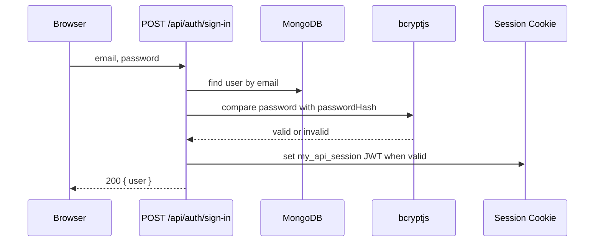
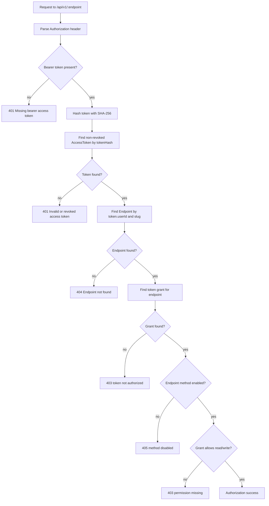

# Auth and Security Flow

This app has two authentication systems:

1. Dashboard sessions for humans using the web UI.
2. Bearer access tokens for external callers using generated REST endpoints.

They are intentionally separate.

## Dashboard Session Auth

Dashboard auth uses email/password login and a signed JWT stored in an
HTTP-only cookie.

Important files:

- `app/api/auth/sign-up/route.ts`
- `app/api/auth/sign-in/route.ts`
- `app/api/auth/sign-out/route.ts`
- `app/api/auth/me/route.ts`
- `lib/auth/password.ts`
- `lib/auth/jwt.ts`
- `lib/auth/session.ts`
- `middleware.ts`
- `lib/api/dashboardAuth.ts`

### Sign-up Flow



The password is never stored directly. `hashPassword()` wraps `bcrypt.hash()`.

If MongoDB reports duplicate key `11000`, the route returns `409 Email already
registered`.

### Sign-in Flow



The sign-in route returns the same generic `Invalid email or password` response
for unknown emails and wrong passwords. This avoids leaking which email
addresses are registered.

### Session Cookie

The cookie name is:

```ts
my_api_session
```

Cookie settings in `createSession()`:

- `httpOnly: true`
- `secure: env.isProd`
- `sameSite: "lax"`
- `path: "/"`
- `maxAge: 7 days`

The JWT itself is signed with `jose` using `SESSION_SECRET`.

The JWT payload contains:

- `sub`: user id
- `email`: user email
- issued-at timestamp
- expiration based on `SESSION_TTL`

### Middleware

`middleware.ts` gates `/dashboard/:path*`.

It only verifies the JWT signature and expiration. It does not query MongoDB.
That is important because middleware runs in the Edge runtime, where Mongoose is
not available.

If verification fails, the user is redirected to:

```text
/sign-in?next=<original-dashboard-path>
```

### Route-Level Dashboard Auth

Dashboard route handlers still call `requireSession()` from
`lib/api/dashboardAuth.ts`.

Middleware is a user-experience gate. Route-level auth is the data-protection
gate.

Pattern:

```ts
const auth = await requireSession();
if ("response" in auth) return auth.response;

await connectDB();
const records = await SomeModel.find({ userId: auth.session.userId });
```

Every query for user-owned data must be scoped by `auth.session.userId`.

## Public API Access Tokens

External clients do not use cookies. They call the public REST engine with a
bearer token:

```http
Authorization: Bearer mapi_<secret>
```

Important files:

- `app/api/tokens/route.ts`
- `app/api/tokens/[id]/route.ts`
- `lib/auth/token.ts`
- `lib/api/publicAuth.ts`
- `lib/api/publicEngine.ts`
- `lib/api/rateLimit.ts`
- `app/api/v1/[endpoint]/route.ts`
- `app/api/v1/[endpoint]/[recordId]/route.ts`

### Token Creation

When a dashboard user creates a token:

1. `POST /api/tokens` validates the requested grants with `createTokenInput`.
2. The route confirms every granted endpoint belongs to the current user.
3. `generateAccessToken()` creates a random plaintext token.
4. The app stores only:
   - `tokenHash`
   - `tokenPrefix`
   - `userId`
   - grants
   - revocation state
5. The route returns the plaintext once.

The plaintext token cannot be recovered later because it is not stored.

### Public Authorization Flow

`authorizePublicRequest()` in `lib/api/publicAuth.ts` is the main public API
security gate.



The most important line is endpoint lookup:

```ts
const endpoint = await Endpoint.findOne({ userId: token.userId, slug });
```

This means endpoint slugs are resolved inside the token owner's namespace.

### Grants

Each access token has one or more grants:

```ts
{
  endpointId: ObjectId,
  read: boolean,
  write: boolean
}
```

Grant rules:

- `GET` requires `read: true`.
- `POST`, `PUT`, `PATCH`, and `DELETE` require `write: true`.
- The endpoint itself must also enable the HTTP method.

A grant alone is not enough. The endpoint must belong to the token's user.

### Revocation

Token revocation is immediate because public authorization always looks up the
token in MongoDB. There is no token-auth cache in front of the database.

The query includes:

```ts
{
  tokenHash: hashToken(raw),
  revoked: false
}
```

### Rate Limiting

After authorization succeeds, `gate()` calls `rateLimit()` with the token id.

Rate limiting is:

- fixed-window
- backed by Redis
- keyed by token id
- controlled by `RATE_LIMIT_MAX` and `RATE_LIMIT_WINDOW`
- fail-open if Redis is unavailable

Responses include:

- `X-RateLimit-Limit`
- `X-RateLimit-Remaining`
- `X-RateLimit-Reset`

If the limit is exceeded, the public API returns status `429`.

## Serialization Safety

API responses use helpers in `lib/api/serialize.ts`.

Sensitive fields are intentionally omitted:

- `passwordHash`
- `tokenHash`

Dashboard token lists show `tokenPrefix`, not the secret token.

## Security Checklist for New Changes

Before merging auth-related changes, check:

1. Does every dashboard data query include `userId: auth.session.userId`?
2. Does every public record query include both `userId` and `endpointId`?
3. Does the public API path go through `gate()`?
4. Does any new serialized response accidentally expose `passwordHash`,
   `tokenHash`, cookies, or raw secrets?
5. Does middleware remain Edge-safe?
6. Are bearer tokens still stored only as hashes?
7. Are revocation checks still live against MongoDB?
8. Are errors specific enough for developers but not leaking sensitive internals?

