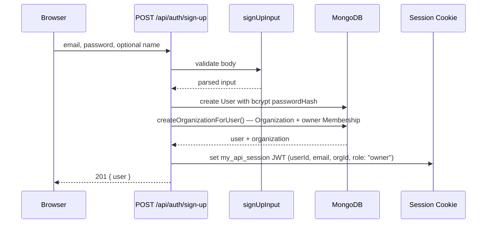
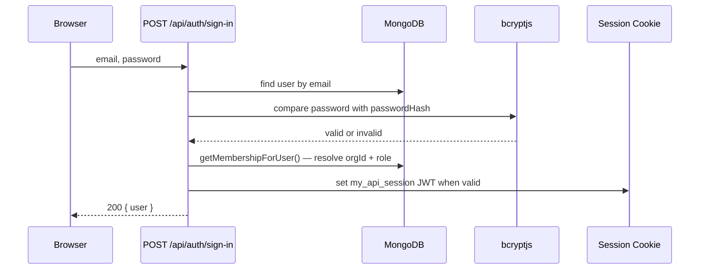
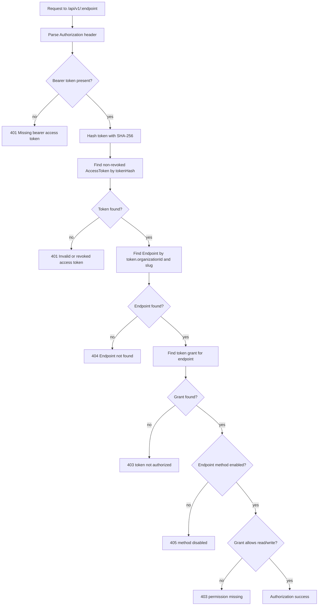

# Auth and Security Flow

This app has two authentication systems:

1. Dashboard sessions for humans using the web UI.
2. Bearer access tokens for external callers using generated REST endpoints.

They are intentionally separate. A third, narrower mechanism — invite tokens
— lets an org owner/admin bring a new teammate in; see "Invites" below.

`Organization` is the tenant boundary, not `User`. Every user has exactly one
`Membership` (role: `owner` / `admin` / `member`) in exactly one organization
— their own (created at sign-up) or one they were invited into. There is no
org-switcher in v1; see [data-model-and-validation.md](./data-model-and-validation.md)
for the full model shapes.

## Dashboard Session Auth

Dashboard auth uses email/password login and a signed JWT stored in an
HTTP-only cookie.

Important files:

- `app/api/auth/sign-up/route.ts`
- `app/api/auth/sign-in/route.ts`
- `app/api/auth/sign-out/route.ts`
- `app/api/auth/me/route.ts`
- `lib/auth/password.ts`
- `lib/auth/jwt.ts`
- `lib/auth/session.ts`
- `middleware.ts`
- `lib/api/dashboardAuth.ts`

### Sign-up Flow



The password is never stored directly. `hashPassword()` wraps `bcrypt.hash()`.
Every sign-up creates a brand-new personal `Organization` (see
`lib/api/organization.ts`'s `createOrganizationForUser()`) — there's no
"join an existing org" step here; that only happens via invite accept.

If MongoDB reports duplicate key `11000`, the route returns `409 Email already
registered`.

### Sign-in Flow



The sign-in route returns the same generic `Invalid email or password` response
for unknown emails, wrong passwords, and the (should-never-happen) case of a
user with no Membership row.

### Session Cookie

The cookie name is:

```ts
my_api_session
```

Cookie settings in `createSession()`:

- `httpOnly: true`
- `secure: env.isProd`
- `sameSite: "lax"`
- `path: "/"`
- `maxAge: 7 days`

The JWT itself is signed with `jose` using `SESSION_SECRET`.

The JWT payload contains:

- `sub`: user id
- `email`: user email
- `orgId`: the user's (one) organization id
- `role`: `"owner"` | `"admin"` | `"member"` within that organization
- issued-at timestamp
- expiration based on `SESSION_TTL`

**Known staleness window:** `orgId`/`role` are embedded in the JWT rather than
looked up per request — consistent with how `userId` has always worked here
(no DB check on every request). If an owner/admin changes another member's
role or removes them, that only takes effect for the affected user the next
time they log in; there's no server-side session revocation list. Don't build
authorization logic that assumes `role` is always fresh.

### Middleware

`middleware.ts` gates `/dashboard/:path*`.

It only verifies the JWT signature and expiration. It does not query MongoDB.
That is important because middleware runs in the Edge runtime, where Mongoose is
not available.

If verification fails, the user is redirected to:

```text
/sign-in?next=<original-dashboard-path>
```

### Route-Level Dashboard Auth

Dashboard route handlers still call `requireSession()` from
`lib/api/dashboardAuth.ts`.

Middleware is a user-experience gate. Route-level auth is the data-protection
gate.

Pattern:

```ts
const auth = await requireSession();
if ("response" in auth) return auth.response;

await connectDB();
const records = await SomeModel.find({ organizationId: auth.session.orgId });
```

Every query for org-owned data (schemas, endpoints, tokens, records) must be
scoped by `auth.session.orgId`. `auth.session.userId` still identifies the
acting human — used for the `createdBy` audit field on writes and for
"is this me" checks (e.g. can't remove yourself as the last owner).

### Organization Role Checks

Some dashboard actions are further restricted to `owner`/`admin` — changing
the org name, switching plans, and managing members/invites. Use
`requireOrgRole()` from `lib/api/orgAuth.ts` after `requireSession()`:

```ts
const auth = await requireSession(t);
if ("response" in auth) return auth.response;
const roleCheck = requireOrgRole(auth.session, ["owner", "admin"], t);
if ("response" in roleCheck) return roleCheck.response;
```

This checks `auth.session.role` from the JWT — no extra DB round trip, same
trust model as the rest of dashboard auth (see the staleness note above).

## Public API Access Tokens

External clients do not use cookies. They call the public REST engine with a
bearer token:

```http
Authorization: Bearer mapi_<secret>
```

Important files:

- `app/api/tokens/route.ts`
- `app/api/tokens/[id]/route.ts`
- `lib/auth/token.ts`
- `lib/api/publicAuth.ts`
- `lib/api/publicEngine.ts`
- `lib/api/rateLimit.ts`
- `app/api/v1/[endpoint]/route.ts`
- `app/api/v1/[endpoint]/[id]/route.ts`

### Token Creation

When a dashboard user creates a token:

1. `POST /api/tokens` validates the requested grants with `createTokenInput`.
2. The route calls `assertUnderLimit()` — the org's plan caps how many tokens
   it can have (see [public-api-engine.md](./public-api-engine.md) and
   `lib/billing/plans.ts`).
3. The route confirms every granted endpoint belongs to the current organization.
4. `generateAccessToken()` creates a random plaintext token.
5. The app stores only:
   - `tokenHash`
   - `tokenPrefix`
   - `organizationId`
   - `createdBy` (audit — who minted it)
   - grants
   - revocation state
6. The route returns the plaintext once.

The plaintext token cannot be recovered later because it is not stored.

### Public Authorization Flow

`authorizePublicRequest()` in `lib/api/publicAuth.ts` is the main public API
security gate.



The most important line is endpoint lookup:

```ts
const endpoint = await Endpoint.findOne({ organizationId: token.organizationId, slug });
```

This means endpoint slugs are resolved inside the token's organization
namespace — any token belonging to an org can reach that org's endpoints,
regardless of which member created the token.

### Grants

Each access token has one or more grants:

```ts
{
  endpointId: ObjectId,
  read: boolean,
  write: boolean
}
```

Grant rules:

- `GET` requires `read: true`.
- `POST`, `PUT`, `PATCH`, and `DELETE` require `write: true`.
- The endpoint itself must also enable the HTTP method.

A grant alone is not enough. The endpoint must belong to the token's user.

### Revocation

Token revocation is immediate because public authorization always looks up the
token in MongoDB. There is no token-auth cache in front of the database.

The query includes:

```ts
{
  tokenHash: hashToken(raw),
  revoked: false
}
```

### Rate Limiting and Monthly Quota

After authorization succeeds, `gate()` looks up the token's organization plan
and applies two checks, both keyed by **organization** (not by token — every
token an org mints shares one budget, so minting more tokens doesn't buy more
throughput):

1. `rateLimit()` — fixed window, per-minute budget from
   `PLAN_LIMITS[plan].requestsPerMinute`.
2. `checkMonthlyQuota()` — UTC-calendar-month counter, from
   `PLAN_LIMITS[plan].requestsPerMonth`.

Both are:

- backed by Redis
- fail-open if Redis is unavailable
- sourced from `lib/billing/plans.ts`, not env vars (`RATE_LIMIT_WINDOW` is
  the only surviving env-configured piece — the shared window length)

Responses include:

- `X-RateLimit-Limit` / `X-RateLimit-Remaining` / `X-RateLimit-Reset` (per-minute)
- `X-Quota-Limit` / `X-Quota-Remaining` (monthly — omitted for unmetered plans)

If the per-minute limit is exceeded, the public API returns `429` with
`api.errors.rateLimitExceeded`. If the monthly quota is exceeded, it returns
`429` with the distinct `api.errors.monthlyQuotaExceeded` — callers can
tell "retry in seconds" apart from "upgrade or wait for next month".

See [public-api-engine.md](./public-api-engine.md) for the full `gate()` flow.

## Organizations, Roles, and Invites

- **Models**: `Organization` (plan, name), `Membership` (userId + organizationId
  + role), `Invite` (pending email invitation). See
  [data-model-and-validation.md](./data-model-and-validation.md).
- **Roles**: `owner` > `admin` > `member`. Only `owner`/`admin` can invite,
  manage members, rename the org, or change the plan. An organization can
  never be left with zero owners — `app/api/account/members/[id]/route.ts`
  blocks the last owner from being demoted or removed
  (`api.errors.lastOwner`).
- **Invite tokens**: single-use, 7-day expiry, stored only as `tokenHash`
  (`generateInviteToken()` in `lib/auth/token.ts` — same hash approach as
  access tokens, but no encrypted-for-reveal copy since an invite link is
  never redisplayed after creation). The plaintext lives only in the emailed
  URL (`/invite/<token>`).
- **Accepting**: `POST /api/invites/[token]` branches on whether the
  invited email already has a `User`:
  - **Existing user** — must already be signed in as that exact email
    (`api.errors.mustSignInToAccept` otherwise). Since v1 gives every user
    exactly one `Membership`, an existing user who already belongs to *any*
    org (including a different one) is rejected with
    `api.errors.alreadyInOrganization` — there's no multi-org support yet.
  - **New user** — the request body must include a `password`; the route
    creates the `User` and `Membership` together, then signs them in.
- **Session reissue**: accepting an invite calls `createSession()` with the
  new `orgId`/`role`, exactly like sign-up/sign-in.

## Serialization Safety

API responses use helpers in `lib/api/serialize.ts`.

Sensitive fields are intentionally omitted:

- `passwordHash`
- `tokenHash` (both `AccessToken.tokenHash` and `Invite.tokenHash`)

Dashboard token lists show `tokenPrefix`, not the secret token. Invite lists
never include the token at all — only the accept-page route resolves one, by
hash, from the URL param.

## Security Checklist for New Changes

Before merging auth-related changes, check:

1. Does every dashboard data query include `organizationId: auth.session.orgId`?
2. Do owner/admin-only actions call `requireOrgRole()`?
3. Does every public record query include both `organizationId` and `endpointId`?
4. Does the public API path go through `gate()` (auth + rate limit + monthly quota)?
5. Do new schema/endpoint/token create routes call `assertUnderLimit()`?
6. Does any new serialized response accidentally expose `passwordHash`,
   `tokenHash`, `Invite.tokenHash`, cookies, or raw secrets?
7. Does middleware remain Edge-safe?
8. Are bearer tokens and invite tokens still stored only as hashes?
9. Are revocation checks still live against MongoDB?
10. Errors specific enough for developers but not leaking sensitive internals?
11. Does changing membership/roles account for the JWT staleness window (see
    "Session Cookie" above) — no route should assume `session.role` is live?
