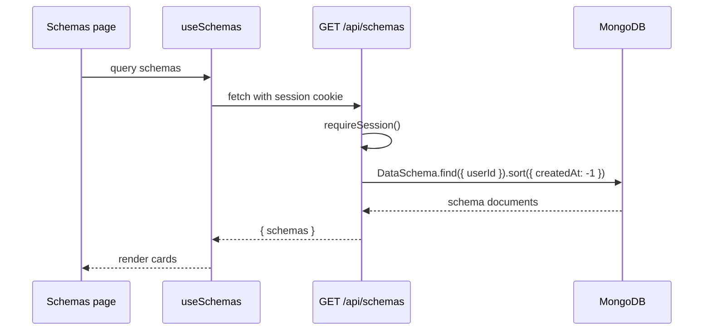

# Dashboard Management Flows

The dashboard lets signed-in users manage three things:

1. Schemas
2. Endpoints
3. Access tokens

The browser talks to cookie-authenticated API routes. Those routes use the
current session to scope every database operation by `userId`.

## Shared Route Handler Pattern

Most dashboard management routes follow this shape:

```ts
return withErrorHandling(async () => {
  const auth = await requireSession();
  if ("response" in auth) return auth.response;

  const body = await req.json().catch(() => null);
  const parsed = someZodInput.safeParse(body);
  if (!parsed.success) {
    return badRequest("Validation failed", { fields: zodErrors(parsed.error) });
  }

  await connectDB();
  // Query or write with userId: auth.session.userId
});
```

This gives every route:

- consistent 401 behavior,
- consistent validation errors,
- safe 500 handling,
- per-user data isolation.

## Schema Flows

Files:

- UI: `app/(dashboard)/dashboard/schemas/page.tsx`
- API list/create: `app/api/schemas/route.ts`
- API read/update/delete: `app/api/schemas/[id]/route.ts`
- Model: `lib/models/DataSchema.ts`
- Hooks: `useSchemas`, `useCreateSchema`, `useUpdateSchema`, `useDeleteSchema`

### List Schemas



### Create Schema

The create modal collects:

- `name`
- `slug`
- one or more fields

The route validates:

1. the request body with `createSchemaInput`,
2. unique field names inside the schema,
3. unique `{ userId, slug }` through the MongoDB index.

Duplicate slug returns `409`.

### Update Schema

`PUT /api/schemas/[id]` validates a partial schema input and updates:

```ts
DataSchema.findOneAndUpdate(
  { _id: id, userId: auth.session.userId },
  { $set: parsed.data },
  { new: true }
)
```

The `{ _id, userId }` filter is important. Without `userId`, a user could update
another user's schema if they knew the id.

After a schema update, the frontend invalidates:

- `keys.schemas`
- `keys.endpoints`

Endpoints are refreshed because they display schema field information.

### Delete Schema

Before deleting, the route checks whether endpoints still depend on the schema:

```ts
Endpoint.countDocuments({
  userId: auth.session.userId,
  schemaId: id
})
```

If the schema is in use, deletion returns `409`. This prevents endpoints from
pointing at missing schemas.

## Endpoint Flows

Files:

- UI: `app/(dashboard)/dashboard/endpoints/page.tsx`
- API list/create: `app/api/endpoints/route.ts`
- API read/update/delete: `app/api/endpoints/[id]/route.ts`
- Model: `lib/models/Endpoint.ts`
- Hooks: `useEndpoints`, `useCreateEndpoint`, `useUpdateEndpoint`,
  `useDeleteEndpoint`

### Create Endpoint

The endpoint modal collects:

- display name,
- slug,
- schema id,
- allowed methods,
- readable fields,
- writable fields.

The route validates:

1. request shape with `createEndpointInput`,
2. the referenced schema exists and belongs to the user,
3. readable fields are fields on that schema,
4. writable fields are fields on that schema,
5. endpoint slug is unique for the user.

The schema ownership check prevents a user from creating an endpoint from
another user's schema.

### Readable and Writable Fields

Readable fields control `GET` output. Writable fields control `POST`, `PUT`, and
`PATCH` input.

An empty list is special:

- `[]` means all schema fields.

The frontend guards against the confusing "I unchecked every box" case. If `GET`
is enabled, the user must select at least one readable field. If write methods
are enabled, the user must select at least one writable field.

### Update Endpoint

The route first loads the existing endpoint by `{ _id, userId }`.

Then it calculates the effective schema:

- if the request changes `schemaId`, use the new schema,
- otherwise use the endpoint's current schema.

After that, it validates field lists against the effective schema.

After an endpoint update, the frontend invalidates:

- `keys.endpoints`
- `keys.tokens`

Tokens are refreshed because token grant displays can depend on endpoint state.

### Delete Endpoint

Deleting an endpoint has cascading cleanup:

```ts
await Promise.all([
  RecordModel.deleteMany({ userId, endpointId: endpoint._id }),
  AccessToken.updateMany(
    { userId },
    { $pull: { grants: { endpointId: endpoint._id } } }
  ),
]);
```

This removes stored records for that endpoint and removes any token grants that
point to it.

## Access Token Flows

Files:

- UI: `app/(dashboard)/dashboard/tokens/page.tsx`
- API list/create: `app/api/tokens/route.ts`
- API read/update/delete: `app/api/tokens/[id]/route.ts`
- Model: `lib/models/AccessToken.ts`
- Token helpers: `lib/auth/token.ts`
- Hooks: `useTokens`, `useCreateToken`, `useUpdateToken`, `useDeleteToken`

### List Tokens

The token list returns metadata only:

- id,
- name,
- token prefix,
- grants,
- last-used timestamp,
- revoked state,
- created timestamp.

It never returns the full token or token hash.

### Create Token

The modal collects:

- token name,
- one or more endpoint grants,
- read/write booleans for each grant.

The route validates every granted endpoint:

```ts
Endpoint.find({
  _id: { $in: endpointIds },
  userId: auth.session.userId
})
```

Then it calls `generateAccessToken()`.

The response includes:

```ts
{
  token: serializeToken(doc),
  plaintext: token
}
```

The frontend shows a special "Token created" screen with the plaintext token and
a copy button. Once that modal closes, the plaintext is gone.

### Update Token

`PATCH /api/tokens/[id]` can:

- rename a token,
- update endpoint grants,
- revoke or re-enable the token.

If grants are included, the route repeats the endpoint ownership check before
saving.

### Delete Token

Deleting a token removes its metadata. The public API will reject future calls
because it can no longer find a non-revoked `AccessToken` with the submitted
hash.

## Client-Side Error Handling

The dashboard fetch wrapper throws `ApiError` for non-2xx responses.

Forms usually handle errors like this:

```ts
try {
  await mutation.mutateAsync(payload);
} catch (err) {
  if (err instanceof ApiError) {
    setError(err.message);
    if (err.fields) setFieldErrors(err.fields);
  } else {
    setError("Something went wrong");
  }
}
```

Use this pattern for new forms so validation errors can appear next to fields.
