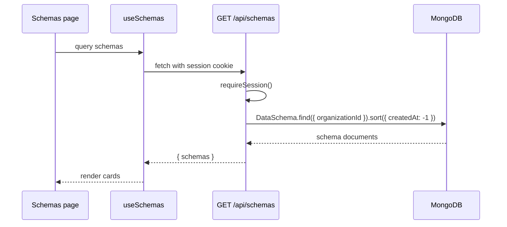
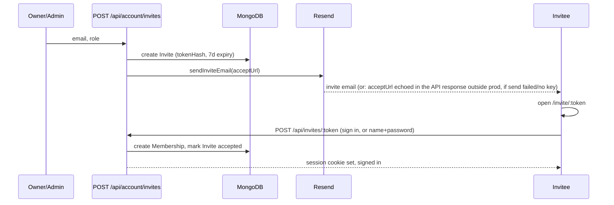

# Dashboard Management Flows

The dashboard lets signed-in users manage:

1. Schemas
2. Endpoints
3. Access tokens
4. Their account: profile, password, organization billing plan, and team
   members/invites (see "Account, Billing, and Team Flows" below)

The browser talks to cookie-authenticated API routes. Those routes use the
current session to scope every database operation by `organizationId`
(schemas/endpoints/tokens/records) or `userId` (the account holder's own
profile/password).

## Shared Route Handler Pattern

Most dashboard management routes follow this shape:

```ts
return withErrorHandling(async () => {
  const auth = await requireSession();
  if ("response" in auth) return auth.response;

  const body = await req.json().catch(() => null);
  const parsed = someZodInput.safeParse(body);
  if (!parsed.success) {
    return badRequest("Validation failed", { fields: zodErrors(parsed.error) });
  }

  await connectDB();
  // Query or write with organizationId: auth.session.orgId
});
```

Routes restricted to owners/admins (plan changes, invites, member management)
add one more line after `requireSession()`:

```ts
const roleCheck = requireOrgRole(auth.session, ["owner", "admin"], t);
if ("response" in roleCheck) return roleCheck.response;
```

This gives every route:

- consistent 401/403 behavior,
- consistent validation errors,
- safe 500 handling,
- per-organization data isolation.

## Schema Flows

Files:

- UI: `app/(dashboard)/dashboard/schemas/page.tsx`
- API list/create: `app/api/schemas/route.ts`
- API read/update/delete: `app/api/schemas/[id]/route.ts`
- Model: `lib/models/DataSchema.ts`
- Hooks: `useSchemas`, `useCreateSchema`, `useUpdateSchema`, `useDeleteSchema`

### List Schemas



### Create Schema

The create modal collects:

- `name`
- `slug`
- one or more fields

The route validates:

1. the request body with `createSchemaInput`,
2. unique field names inside the schema,
3. the organization is under its plan's schema cap (`assertUnderLimit()`) —
   returns `403` if not,
4. unique `{ organizationId, slug }` through the MongoDB index.

Duplicate slug returns `409`.

### Update Schema

`PUT /api/schemas/[id]` validates a partial schema input and updates:

```ts
DataSchema.findOneAndUpdate(
  { _id: id, organizationId: auth.session.orgId },
  { $set: parsed.data },
  { new: true }
)
```

The `{ _id, organizationId }` filter is important. Without `organizationId`,
a member of one org could update another org's schema if they knew the id.

After a schema update, the frontend invalidates:

- `keys.schemas`
- `keys.endpoints`

Endpoints are refreshed because they display schema field information.

### Delete Schema

Before deleting, the route checks whether endpoints still depend on the schema:

```ts
Endpoint.countDocuments({
  organizationId: auth.session.orgId,
  schemaId: id
})
```

If the schema is in use, deletion returns `409`. This prevents endpoints from
pointing at missing schemas.

## Endpoint Flows

Files:

- UI: `app/(dashboard)/dashboard/endpoints/page.tsx`
- API list/create: `app/api/endpoints/route.ts`
- API read/update/delete: `app/api/endpoints/[id]/route.ts`
- Model: `lib/models/Endpoint.ts`
- Hooks: `useEndpoints`, `useCreateEndpoint`, `useUpdateEndpoint`,
  `useDeleteEndpoint`

### Create Endpoint

The endpoint modal collects:

- display name,
- slug,
- schema id,
- allowed methods,
- readable fields,
- writable fields.

The route validates:

1. request shape with `createEndpointInput`,
2. the organization is under its plan's endpoint cap (`assertUnderLimit()`),
3. the referenced schema exists and belongs to the organization,
4. readable fields are fields on that schema,
5. writable fields are fields on that schema,
6. endpoint slug is unique for the organization.

The schema ownership check prevents a member of one org from creating an
endpoint from another org's schema.

### Readable and Writable Fields

Readable fields control `GET_MANY` and `GET` output. Writable fields control
`POST`, `PUT`, and `PATCH` input.

An empty list is special:

- `[]` means all schema fields.

The frontend guards against the confusing "I unchecked every box" case. If a
read method is enabled, the user must select at least one readable field. If
write methods are enabled, the user must select at least one writable field.

### Update Endpoint

The route first loads the existing endpoint by `{ _id, organizationId }`.

Then it calculates the effective schema:

- if the request changes `schemaId`, use the new schema,
- otherwise use the endpoint's current schema.

After that, it validates field lists against the effective schema.

After an endpoint update, the frontend invalidates:

- `keys.endpoints`
- `keys.tokens`

Tokens are refreshed because token grant displays can depend on endpoint state.

### Delete Endpoint

Deleting an endpoint has cascading cleanup:

```ts
await Promise.all([
  RecordModel.deleteMany({ organizationId, endpointId: endpoint._id }),
  AccessToken.updateMany(
    { organizationId },
    { $pull: { grants: { endpointId: endpoint._id } } }
  ),
]);
```

This removes stored records for that endpoint and removes any token grants that
point to it.

## Access Token Flows

Files:

- UI: `app/(dashboard)/dashboard/tokens/page.tsx`
- API list/create: `app/api/tokens/route.ts`
- API read/update/delete: `app/api/tokens/[id]/route.ts`
- Model: `lib/models/AccessToken.ts`
- Token helpers: `lib/auth/token.ts`
- Hooks: `useTokens`, `useCreateToken`, `useUpdateToken`, `useDeleteToken`

### List Tokens

The token list returns metadata only:

- id,
- name,
- token prefix,
- grants,
- last-used timestamp,
- revoked state,
- created timestamp.

It never returns the full token or token hash.

### Create Token

The modal collects:

- token name,
- one or more endpoint grants,
- read/write booleans for each grant.

The route first checks the organization is under its plan's token cap
(`assertUnderLimit()`), then validates every granted endpoint:

```ts
Endpoint.find({
  _id: { $in: endpointIds },
  organizationId: auth.session.orgId
})
```

Then it calls `generateAccessToken()`.

The response includes:

```ts
{
  token: serializeToken(doc),
  plaintext: token
}
```

The frontend shows a special "Token created" screen with the plaintext token and
a copy button. Once that modal closes, the plaintext is gone.

### Update Token

`PATCH /api/tokens/[id]` can:

- rename a token,
- update endpoint grants,
- revoke or re-enable the token.

If grants are included, the route repeats the endpoint ownership check before
saving.

### Delete Token

Deleting a token removes its metadata. The public API will reject future calls
because it can no longer find a non-revoked `AccessToken` with the submitted
hash.

## Account, Billing, and Team Flows

Files:

- UI: `app/(dashboard)/dashboard/account/{profile,security,billing,team}/page.tsx`
  → thin re-exports of `components/pages/dashboard/account/*`
- API: `app/api/account/**`, plus the public `app/api/invites/[token]/route.ts`
- Models: `Organization`, `Membership`, `Invite`
- Hooks: `useAccountProfile`, `useUpdateProfile`, `useChangePassword`,
  `useOrganization`, `useUpgradePlan`, `useMembers`, `useUpdateMemberRole`,
  `useRemoveMember`, `useInvites`, `useCreateInvite`, `useRevokeInvite`,
  `useResendInvite`, `useInviteDetails`, `useAcceptInvite`

### Profile and Security

`PATCH /api/account/profile` updates `name` and/or `email`. Changing `email`
requires `currentPassword` in the same request (enforced by
`updateProfileInput`'s Zod `superRefine`) — a re-auth step for a sensitive
change, mirroring how password change already requires the current password.
`POST /api/account/password` is a separate endpoint requiring
`{currentPassword, newPassword}`. Neither invalidates other active sessions
— there's no session-revocation store (see auth-and-security.md).

### Billing

`PATCH /api/account/organization/plan` (owner/admin only) instantly sets
`Organization.plan` to `hobby | pro | enterprise`. No payment is collected —
this is a mock. The billing page reuses the landing page's
`landing.pricing.tiers.*` i18n copy so the marketed tiers and the in-app
switcher never drift apart.

### Team



A failed email send does **not** fail invite creation — the route returns
`{ invite, emailSent: false }` so the UI can offer "resend" instead of
erroring. See auth-and-security.md's "Organizations, Roles, and Invites"
section for the accept-flow branching (existing vs. new user) and the v1
single-org-per-user limitation.

`/invite/[token]` is deliberately **not** under `app/(auth)` — that route
group's layout redirects any signed-in visitor to the dashboard, which would
break the "sign in as the invited email, then accept" path for invitees who
already have an account.

## Client-Side Error Handling

The dashboard fetch wrapper throws `ApiError` for non-2xx responses.

Forms usually handle errors like this:

```ts
try {
  await mutation.mutateAsync(payload);
} catch (err) {
  if (err instanceof ApiError) {
    setError(err.message);
    if (err.fields) setFieldErrors(err.fields);
  } else {
    setError("Something went wrong");
  }
}
```

Use this pattern for new forms so validation errors can appear next to fields.
