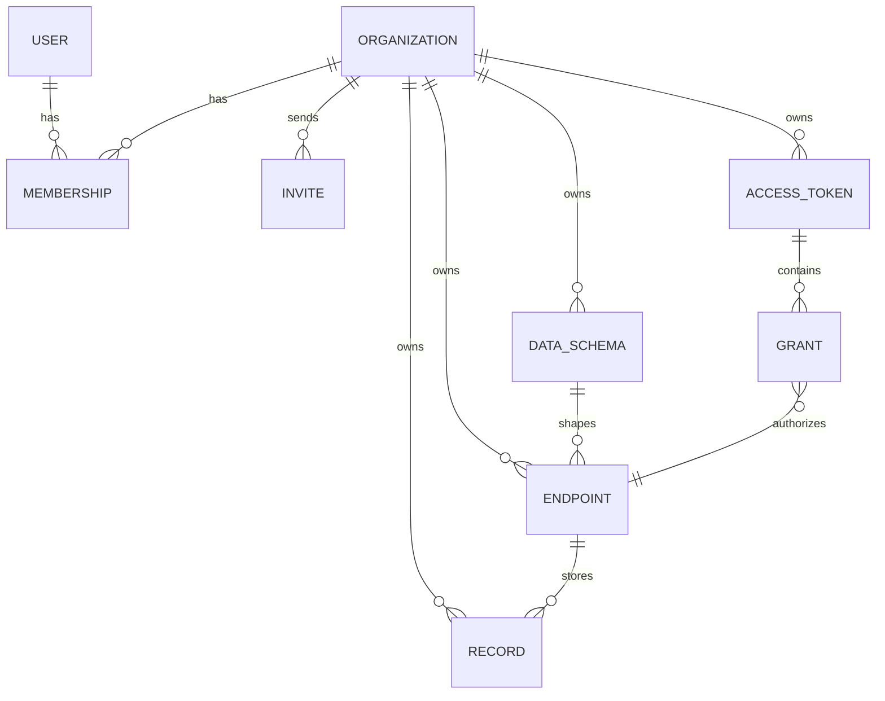

# Data Model and Validation

MongoDB stores the product state. Mongoose models define the document shapes and
indexes. Runtime validation happens in both Zod schemas and custom record-data
validation.

## Model Relationship Summary



`Organization` is the tenant boundary — it owns schemas, endpoints, tokens,
and records. `User` is a login identity that joins an organization through a
`Membership`. v1 gives every user exactly one `Membership`.

## User

File: `lib/models/User.ts`

Fields:

- `email`: required, unique, lowercase, trimmed.
- `passwordHash`: required bcrypt hash.
- `name`: optional, trimmed.
- timestamps.

`User` intentionally has no `plan` or `organizationId` field — billing lives
on `Organization`, membership lives in `Membership`. Look a user's org up via
`Membership.findOne({ userId })` (v1 assumes exactly one result).

## Organization

File: `lib/models/Organization.ts`

The tenant boundary and the subscription-tier boundary.

Fields:

- `name`: display name (defaults to `"<name or email>'s workspace"` at sign-up).
- `slug`: unique, generated, not currently user-facing.
- `plan`: `"hobby" | "pro" | "enterprise"`, default `"hobby"`. No payment
  processor — switching plans (`PATCH /api/account/organization/plan`) just
  writes this field. See `lib/billing/plans.ts` for what each plan unlocks.
- `ownerId`: the founding member (convenience only — the authoritative
  owner list is `Membership` rows with `role: "owner"`).
- timestamps.

## Membership

File: `lib/models/Membership.ts`

Joins a `User` to an `Organization` with a role.

Fields:

- `organizationId`, `userId`: both required, both indexed.
- `role`: `"owner" | "admin" | "member"`.
- timestamps.

Index: `{ organizationId: 1, userId: 1 }` unique — a user can't be added to
the same org twice. There is **no** unique index on `userId` alone; v1
enforces "one org per user" in application code (sign-up and invite-accept),
not the schema, so multi-org support can be added later without a migration.

An organization must always have at least one `role: "owner"` membership —
enforced in `app/api/account/members/[id]/route.ts`, not by the schema.

## Invite

File: `lib/models/Invite.ts`

A pending (or resolved) invitation to join an `Organization`.

Fields:

- `organizationId`, `email`, `role` (`"admin" | "member"` — never `"owner"`).
- `invitedBy`: the inviting user.
- `tokenHash`: sha256 of the plaintext token, same approach as `AccessToken`
  but without an encrypted-for-reveal copy (invite links are never
  redisplayed after creation).
- `status`: `"pending" | "accepted" | "revoked"`.
- `expiresAt`: 7 days from creation (or from the last resend).
- `acceptedAt`, `acceptedBy`: set on accept.
- timestamps.

Indexes: `{ tokenHash: 1 }` unique (accept lookup); `{ organizationId: 1,
email: 1, status: 1 }` (detect an already-pending invite for that email).

Expiry is checked live (`expiresAt.getTime() < Date.now()`) rather than via a
cron job or lazy status flip — simpler, and `status` already distinguishes
revoked/accepted from "still pending, check the date."

## DataSchema

File: `lib/models/DataSchema.ts`

A `DataSchema` is an organization-defined data type.

Fields:

- `organizationId`: owner.
- `createdBy`: which user created it (audit only — not used for scoping).
- `name`: display name.
- `slug`: lowercase machine-friendly name.
- `fields`: array of field definitions.
- timestamps.

Field definition:

```ts
{
  name: string;
  type: "string" | "number" | "boolean" | "date";
  required: boolean;
  unique: boolean;
  enumValues?: string[];
}
```

Index:

```ts
{ organizationId: 1, slug: 1 }, { unique: true }
```

That means two different organizations may both have a schema slug like
`note`, but one organization cannot create two schemas with the same slug —
so all members of an org share that slug namespace.

Important note: `unique` is currently stored and displayed on fields, but the
record engine does not currently enforce uniqueness of `data.<field>` values.
If you build that feature, it should be enforced per `{ organizationId, endpointId }`.

Creating a schema is capped by the org's plan — see `assertUnderLimit()` in
[public-api-engine.md](./public-api-engine.md).

## Endpoint

File: `lib/models/Endpoint.ts`

An `Endpoint` exposes one `DataSchema` as a REST resource.

Fields:

- `organizationId`: owner.
- `createdBy`: which user created it (audit only).
- `schemaId`: referenced `DataSchema`.
- `name`: display name.
- `slug`: URL segment used by `/api/v1/:slug`.
- `methods`: enabled endpoint operations.
- `readableFields`: fields returned by `GET_MANY` and `GET`.
- `writableFields`: fields accepted by `POST`, `PUT`, and `PATCH`.
- timestamps.

Supported methods:

```ts
["GET_MANY", "GET", "POST", "PUT", "PATCH", "DELETE", "PUT_MANY", "PATCH_MANY"]
```

Index:

```ts
{ organizationId: 1, slug: 1 }, { unique: true }
```

### Empty Field Lists Mean "All"

For endpoints, an empty field list is a sentinel:

- `readableFields: []` means all schema fields are readable.
- `writableFields: []` means all schema fields are writable.

The frontend expands this sentinel into checked boxes for display, then collapses
back to `[]` only when all fields are selected. This lets endpoints
automatically include fields added to the schema later.

Do not treat an empty list as "no fields" unless you intentionally change this
contract across the frontend and backend together.

## AccessToken

File: `lib/models/AccessToken.ts`

An `AccessToken` is metadata for an external bearer token.

Fields:

- `organizationId`: owner. Every token an org mints shares that org's
  plan-derived rate limit and monthly quota (see
  [public-api-engine.md](./public-api-engine.md)) — throughput isn't per-token.
- `createdBy`: which user minted it (audit only).
- `name`: dashboard label.
- `tokenHash`: SHA-256 hash of the plaintext token.
- `tokenPrefix`: short safe prefix for display.
- `grants`: array of endpoint permissions.
- `lastUsedAt`: best-effort timestamp.
- `revoked`: boolean.
- timestamps.

Creating a token is capped by the org's plan — see `assertUnderLimit()`.

Grant shape:

```ts
{
  endpointId: ObjectId;
  read: boolean;
  write: boolean;
}
```

Only `tokenHash` is stored. The plaintext token is shown once during creation.

## Record

File: `lib/models/Record.ts`

A `Record` is one stored item, owned by a `DataSchema` (endpoints are
projections over the schema's data pool — `endpointId` is provenance, not
ownership).

Fields:

- `organizationId`: owner.
- `createdBy`: which user created it. For dashboard-created entries this is
  the signed-in user; for records created through the public API (no signed-in
  user, only a bearer token) it's the token's `createdBy` — the user who
  minted that token, as a best-effort audit trail.
- `schemaId`: the schema this record belongs to.
- `endpointId`: which endpoint the record was created through (nullable for
  dashboard-created entries).
- `data`: flexible object validated against the schema at write time.
- timestamps.

Index:

```ts
{ schemaId: 1, organizationId: 1, createdAt: -1 }
```

The index matches the main access pattern: list records for one schema owned
by one organization, sorted newest first.

## Validation Layers

There are two validation systems because the app validates two different kinds
of data.

### Dashboard Input Validation with Zod

File: `lib/validation/schemas.ts`

Zod validates configuration data:

- auth inputs
- schema definitions
- endpoint definitions
- token definitions

Example:

```ts
const parsed = createSchemaInput.safeParse(body);
if (!parsed.success) {
  return badRequest("Validation failed", { fields: zodErrors(parsed.error) });
}
```

Zod checks basic shape, types, string lengths, and slug/field-name formats.

Some rules are still handled in route handlers because they need context:

- field names must be unique within a schema.
- a referenced schema must exist and belong to the current organization.
- readable and writable fields must belong to the selected schema.
- granted endpoints must exist and belong to the current organization.
- the organization must be under its plan's resource cap (schemas/endpoints/
  tokens) — see `assertUnderLimit()` in `lib/billing/enforceLimit.ts`.

### Record Data Validation

File: `lib/records/validate.ts`

Public API record payloads are dynamic because each endpoint has a user-defined
schema. Static Zod schemas are not practical here, so the app validates records
with `validateRecordData()`.

Inputs:

- schema fields loaded through `loadFields(auth)`.
- raw request body.
- options:
  - `partial: true` for `PATCH`.
  - `writableFields` from the endpoint.

Behavior:

1. The body must be a JSON object.
2. Unknown fields are ignored.
3. Fields not in `writableFields` are ignored.
4. Required fields are enforced unless `partial` is true.
5. Values are coerced by field type.
6. Enum constraints are enforced if present.
7. The function returns either cleaned `value` or `errors`.

Supported coercions:

| Field type | Accepted values |
| --- | --- |
| `string` | strings, numbers, booleans converted with `String()` |
| `number` | finite numbers, numeric strings |
| `boolean` | booleans, `"true"`, `"false"` |
| `date` | valid Date objects, date strings, timestamps |

### Read Projection

`projectReadable()` reduces stored record data before returning it from `GET`
responses.

If `readableFields` is empty, all data is returned. Otherwise only listed fields
are included.

### Query Filter Coercion

`coerceScalar()` converts query-string filters to schema-aware values.

Example:

```http
GET /api/v1/tasks?done=true
```

If `done` is a readable boolean field, the string `"true"` is coerced to boolean
`true` and used in the MongoDB filter:

```ts
filter["data.done"] = true;
```

## Serialization

File: `lib/api/serialize.ts`

Mongoose documents are converted to JSON-safe objects before returning them.

Reasons:

- Convert `_id` ObjectIds to string `id` values.
- Avoid leaking sensitive fields.
- Normalize nullable values.
- Keep browser DTOs stable.

Never return raw Mongoose documents from route handlers if they contain secrets
or internal fields.

## Delete Behavior

Schema delete:

- Refuses to delete when any endpoint still references the schema.
- Returns `409` with a message telling the user to delete endpoints first.

Endpoint delete:

- Deletes the endpoint.
- Deletes records for that endpoint.
- Pulls matching grants out of the organization's access tokens.

Token delete:

- Deletes the token metadata.
- Calls using that token stop working because authorization cannot find the
  `tokenHash`.

Token revoke:

- Leaves the token metadata in place.
- Sets `revoked: true`.
- Public authorization rejects it immediately.

Member remove / invite revoke:

- Removing a `Membership` is a hard delete, but is refused if it would leave
  the organization with zero `role: "owner"` members
  (`api.errors.lastOwner`).
- Revoking an `Invite` is a soft delete (`status: "revoked"`) — the row stays
  for audit purposes; the accept route rejects revoked invites explicitly
  rather than treating them as "not found."
