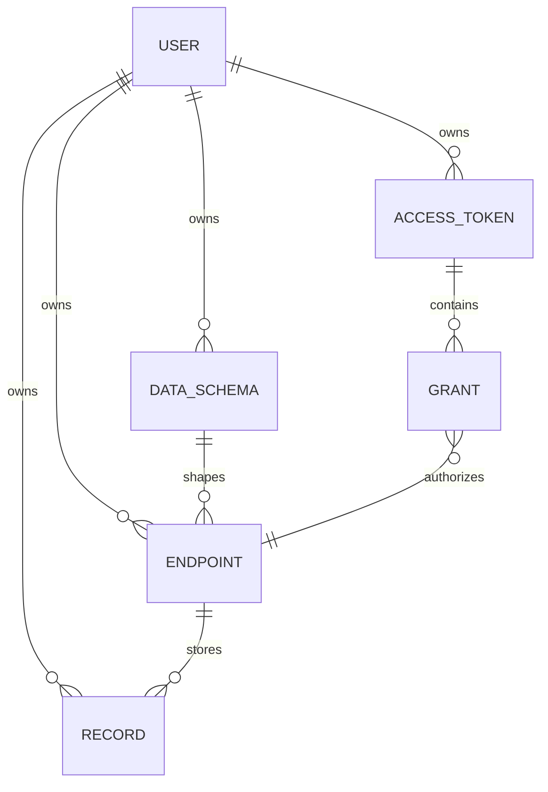

# Data Model and Validation

MongoDB stores the product state. Mongoose models define the document shapes and
indexes. Runtime validation happens in both Zod schemas and custom record-data
validation.

## Model Relationship Summary



## User

File: `lib/models/User.ts`

Fields:

- `email`: required, unique, lowercase, trimmed.
- `passwordHash`: required bcrypt hash.
- `name`: optional, trimmed.
- timestamps.

Users are the tenant boundary. Most other models store `userId`.

## DataSchema

File: `lib/models/DataSchema.ts`

A `DataSchema` is a user-defined data type.

Fields:

- `userId`: owner.
- `name`: display name.
- `slug`: lowercase machine-friendly name.
- `fields`: array of field definitions.
- timestamps.

Field definition:

```ts
{
  name: string;
  type: "string" | "number" | "boolean" | "date";
  required: boolean;
  unique: boolean;
  enumValues?: string[];
}
```

Index:

```ts
{ userId: 1, slug: 1 }, { unique: true }
```

That means two different users may both have a schema slug like `note`, but one
user cannot create two schemas with the same slug.

Important note: `unique` is currently stored and displayed on fields, but the
record engine does not currently enforce uniqueness of `data.<field>` values.
If you build that feature, it should be enforced per `{ userId, endpointId }`.

## Endpoint

File: `lib/models/Endpoint.ts`

An `Endpoint` exposes one `DataSchema` as a REST resource.

Fields:

- `userId`: owner.
- `schemaId`: referenced `DataSchema`.
- `name`: display name.
- `slug`: URL segment used by `/api/v1/:slug`.
- `methods`: enabled endpoint operations.
- `readableFields`: fields returned by `GET_MANY` and `GET`.
- `writableFields`: fields accepted by `POST`, `PUT`, and `PATCH`.
- timestamps.

Supported methods:

```ts
["GET_MANY", "GET", "POST", "PUT", "PATCH", "DELETE", "PUT_MANY", "PATCH_MANY"]
```

Index:

```ts
{ userId: 1, slug: 1 }, { unique: true }
```

### Empty Field Lists Mean "All"

For endpoints, an empty field list is a sentinel:

- `readableFields: []` means all schema fields are readable.
- `writableFields: []` means all schema fields are writable.

The frontend expands this sentinel into checked boxes for display, then collapses
back to `[]` only when all fields are selected. This lets endpoints
automatically include fields added to the schema later.

Do not treat an empty list as "no fields" unless you intentionally change this
contract across the frontend and backend together.

## AccessToken

File: `lib/models/AccessToken.ts`

An `AccessToken` is metadata for an external bearer token.

Fields:

- `userId`: owner.
- `name`: dashboard label.
- `tokenHash`: SHA-256 hash of the plaintext token.
- `tokenPrefix`: short safe prefix for display.
- `grants`: array of endpoint permissions.
- `lastUsedAt`: best-effort timestamp.
- `revoked`: boolean.
- timestamps.

Grant shape:

```ts
{
  endpointId: ObjectId;
  read: boolean;
  write: boolean;
}
```

Only `tokenHash` is stored. The plaintext token is shown once during creation.

## Record

File: `lib/models/Record.ts`

A `Record` is one stored item for one endpoint.

Fields:

- `userId`: owner.
- `endpointId`: endpoint that stores the record.
- `data`: flexible object validated against the endpoint schema at write time.
- timestamps.

Index:

```ts
{ endpointId: 1, userId: 1, createdAt: -1 }
```

The index matches the main public API access pattern: list records for one
endpoint owned by one user, sorted newest first.

## Validation Layers

There are two validation systems because the app validates two different kinds
of data.

### Dashboard Input Validation with Zod

File: `lib/validation/schemas.ts`

Zod validates configuration data:

- auth inputs
- schema definitions
- endpoint definitions
- token definitions

Example:

```ts
const parsed = createSchemaInput.safeParse(body);
if (!parsed.success) {
  return badRequest("Validation failed", { fields: zodErrors(parsed.error) });
}
```

Zod checks basic shape, types, string lengths, and slug/field-name formats.

Some rules are still handled in route handlers because they need context:

- field names must be unique within a schema.
- a referenced schema must exist and belong to the current user.
- readable and writable fields must belong to the selected schema.
- granted endpoints must exist and belong to the current user.

### Record Data Validation

File: `lib/records/validate.ts`

Public API record payloads are dynamic because each endpoint has a user-defined
schema. Static Zod schemas are not practical here, so the app validates records
with `validateRecordData()`.

Inputs:

- schema fields loaded through `loadFields(auth)`.
- raw request body.
- options:
  - `partial: true` for `PATCH`.
  - `writableFields` from the endpoint.

Behavior:

1. The body must be a JSON object.
2. Unknown fields are ignored.
3. Fields not in `writableFields` are ignored.
4. Required fields are enforced unless `partial` is true.
5. Values are coerced by field type.
6. Enum constraints are enforced if present.
7. The function returns either cleaned `value` or `errors`.

Supported coercions:

| Field type | Accepted values |
| --- | --- |
| `string` | strings, numbers, booleans converted with `String()` |
| `number` | finite numbers, numeric strings |
| `boolean` | booleans, `"true"`, `"false"` |
| `date` | valid Date objects, date strings, timestamps |

### Read Projection

`projectReadable()` reduces stored record data before returning it from `GET`
responses.

If `readableFields` is empty, all data is returned. Otherwise only listed fields
are included.

### Query Filter Coercion

`coerceScalar()` converts query-string filters to schema-aware values.

Example:

```http
GET /api/v1/tasks?done=true
```

If `done` is a readable boolean field, the string `"true"` is coerced to boolean
`true` and used in the MongoDB filter:

```ts
filter["data.done"] = true;
```

## Serialization

File: `lib/api/serialize.ts`

Mongoose documents are converted to JSON-safe objects before returning them.

Reasons:

- Convert `_id` ObjectIds to string `id` values.
- Avoid leaking sensitive fields.
- Normalize nullable values.
- Keep browser DTOs stable.

Never return raw Mongoose documents from route handlers if they contain secrets
or internal fields.

## Delete Behavior

Schema delete:

- Refuses to delete when any endpoint still references the schema.
- Returns `409` with a message telling the user to delete endpoints first.

Endpoint delete:

- Deletes the endpoint.
- Deletes records for that endpoint.
- Pulls matching grants out of the user's access tokens.

Token delete:

- Deletes the token metadata.
- Calls using that token stop working because authorization cannot find the
  `tokenHash`.

Token revoke:

- Leaves the token metadata in place.
- Sets `revoked: true`.
- Public authorization rejects it immediately.
